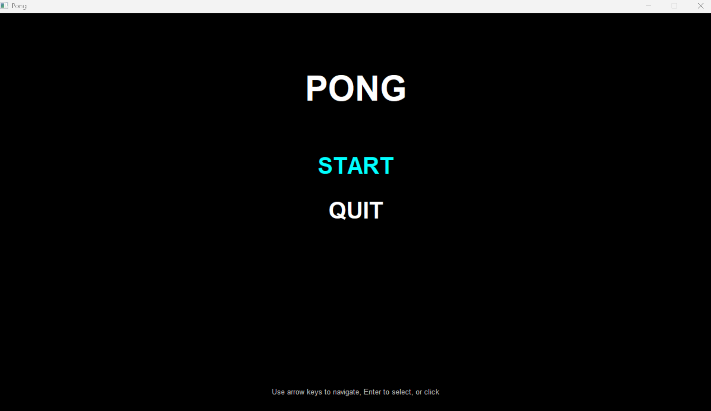
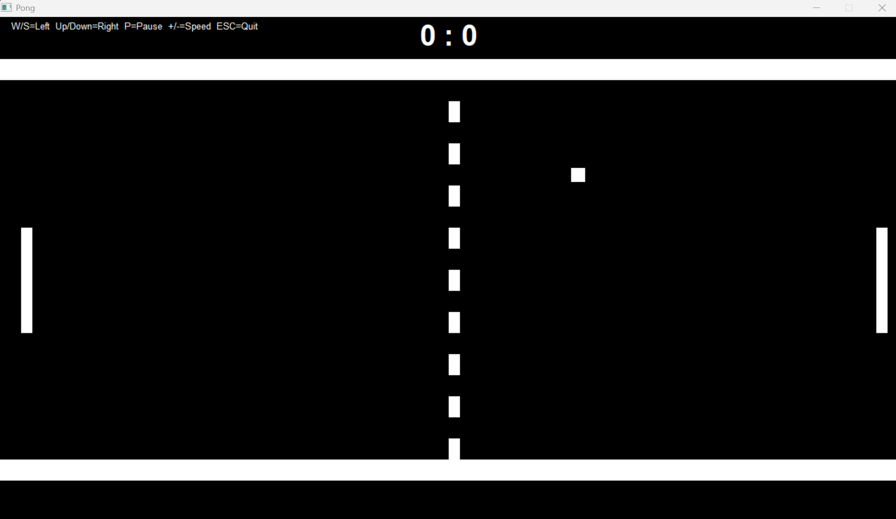

# Pong-Clone

Pong game implemented in C++ using Win32 API.

## Screenshots





## Compile & execute

To compile the project:

```bash
g++ -std=c++11 -o pong.exe main.cpp game_logic.cpp renderer.cpp window.cpp audio.cpp menu.cpp -lgdi32 -luser32 -lwinmm
```

to execute:

```bash
.\pong.exe
```
